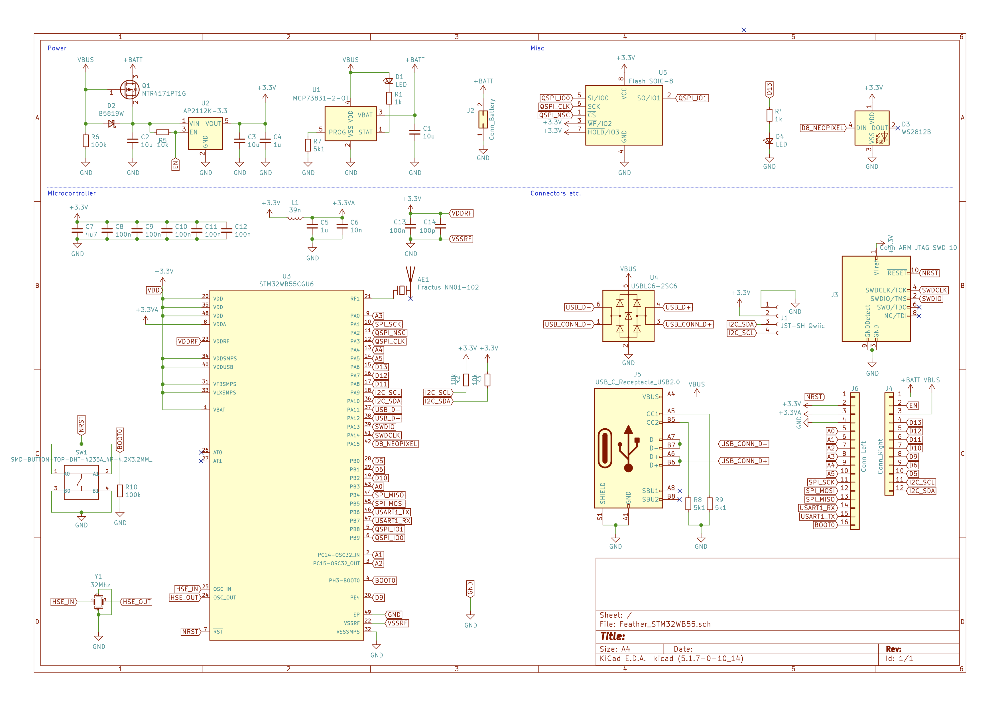
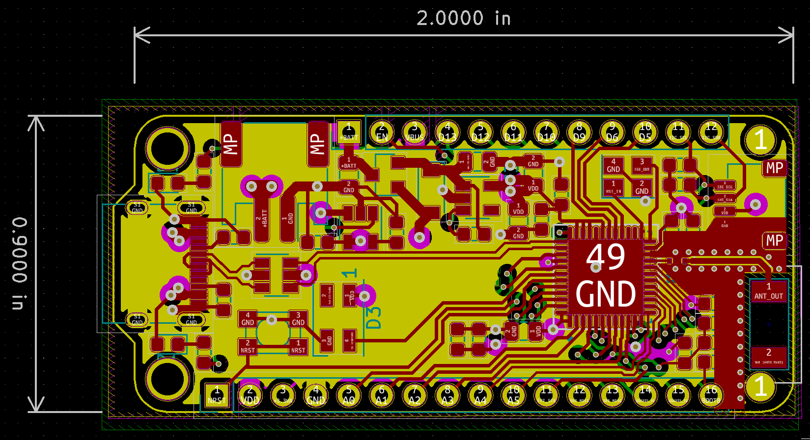
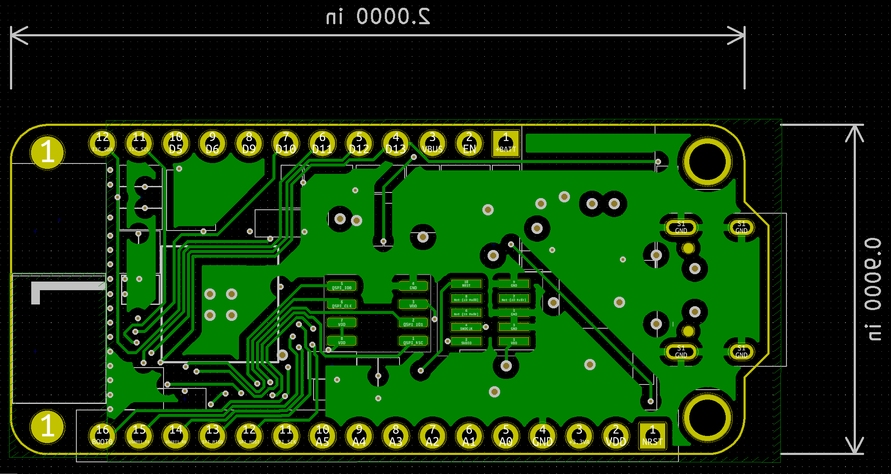

# Feather STM32WB55

## WARNING: Work In Progress

This is a work in progress, it may not work at all.  :)

## Overview

I have several (Adafruit Feather)[https://www.adafruit.com/category/943] boards, and Adafruit handily publish the (Feather Specification)[https://learn.adafruit.com/adafruit-feather/feather-specification] here to make your own.  

I recently discovered the STM32WB series of microcontrollers which include Bluetooth connectivity and decided to build my own development board around it.  This repository is my first attempt at designing it and builds upon the great work of several sources (see Acknowledgements below).

## Schematic

## PCB

## TODO

* Create footprints for the smaller WS2812B-mini 3.5x3.5mm Neopixel
* Create footprints for the [Fractus Antenna](https://fractusantennas.com/compact-reach-xtend-nn01-102/)

## Acknowledgements

* [Adafruit](https://www.adafruit.com/)
* [YouTube: Phil's Lab](https://www.youtube.com/c/PhilS94/videos)
