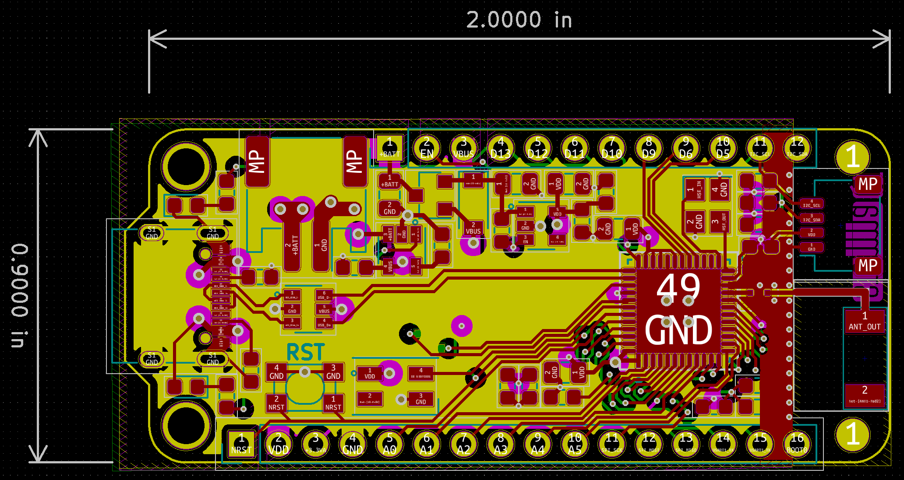
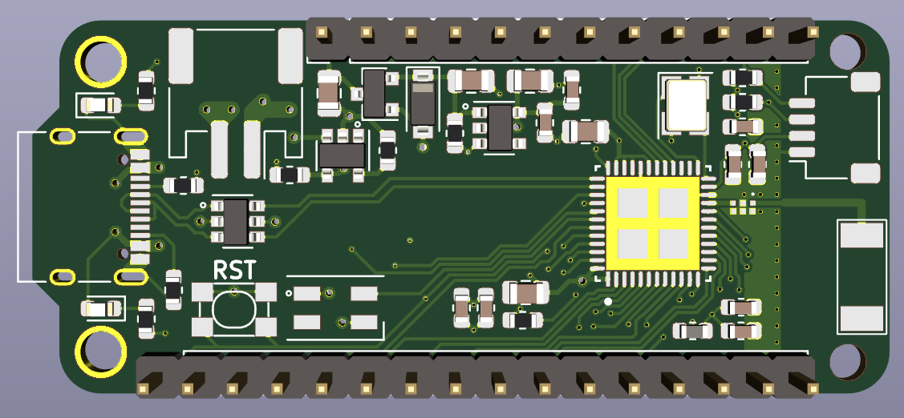
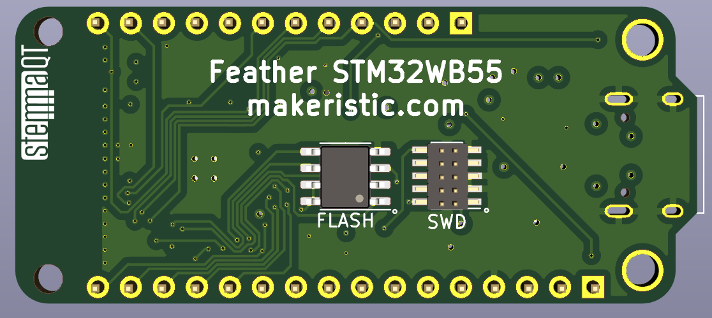

# Feather STM32WB55

## WARNING: Work In Progress

This is a work in progress, it may not work at all.  :)

## Overview

I have several (Adafruit Feather)[https://www.adafruit.com/category/943] boards, and Adafruit handily publish the (Feather Specification)[https://learn.adafruit.com/adafruit-feather/feather-specification] here to make your own.  

I recently discovered the STM32WB series of microcontrollers which include Bluetooth connectivity and decided to build my own development board around it.  This repository is my first attempt at designing it and builds upon the great work of several sources (see Acknowledgements below).

The ultimate goal is to get this board working and running [CircuitPython](https://circuitpython.org/), once working I may do another revision with a focus on enabling more of the low power features of the STM32WB series.

## Features

* [STM32WB55CGU6](https://www.st.com/en/microcontrollers-microprocessors/stm32wb55cg.html) microcontroller
* Adafruit Feather compatible, with USB-C
* (Optional) QSPI-Dual flash module can be soldered to the back
* (Optional) ARM SWD 10-pin debug connector can be soldered on the back

## Notes

* I've tried to standardise on 0.2mm tracks for signals, 0.3mm tracks for power.  VBUS and +BATT do have high-current tracks/pours to their respective pins to allow for powering things off-board like Neopixels.
* STMicroelectronics produce a custom matching network for this chip [MLPF-WB55-01E3](https://www.st.com/en/emi-filtering-and-signal-conditioning/mlpf-wb55-01e3.html), the recommended PCB layout has been implemented here.
* The [Fractus Antenna](https://fractusantennas.com/compact-reach-xtend-nn01-102/) has a recommended layout which is implemented here.  The clearance area essentially takes up the entire tip of the board, though I have cheekily added the STEMMA QT connector, figuring it shouldn't have too big an impact.
* There is a lot of space around the center of the board, this is semi-intentional so I can extend the design with sensors, or an additional button.

## Schematic

## PCB

## 3D Render

## TODO

* Create footprints for the smaller WS2812B-mini 3.5x3.5mm Neopixel
* Create footprints for the [Fractus Antenna](https://fractusantennas.com/compact-reach-xtend-nn01-102/)
* Do I need a matching network?  STM sell a ready-made part

## Acknowledgements

* [Adafruit](https://www.adafruit.com/)
* [YouTube: Phil's Lab](https://www.youtube.com/c/PhilS94/videos)
